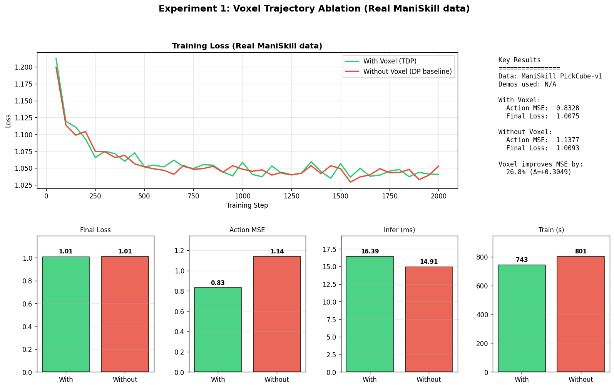

# CLR-VLMTDP

**Closed-loop Robust Vision-Language Model guided Trajectory Diffusion Policy**

面向具身智能的闭环鲁棒长时序机器人操控系统

基于腾讯 Robotics X 的 [VLM-TDP 论文](https://arxiv.org/abs/2507.04524)，通过三项关键改进打造高鲁棒、高效率的工业级长时序机器人操控系统。

---

## 🎯 核心改进 vs 原始 VLM-TDP

| 改进项 | 原始 VLM-TDP | CLR-VLMTDP | 实现状态 |
|---|---|---|---|
| **闭环重规划** | 开环规划，误差累积 | 生成-执行-验证-重规划 | ✅ 设计文档 §2.1 |
| **Flow Matching** | DDPM 扩散，16 步推理 | 条件流匹配，1 步 Euler 积分 | ✅ `models/flow_tdp.py` |
| **轻量体素编码器** | 标准 3D 卷积 (~374K 参数) | 深度可分离卷积 (~44K 参数) | ✅ `models/light_voxel_encoder.py` |
| **真实 VLM** | GPT-4o API | OpenAI 兼容 API（gpt-4o-mini） | ✅ `models/vlm_wrapper.py` |
| **轨迹生成** | mask-based visual prompting | 完整工具链 | ✅ `utils/voxel_trajectory.py` + `utils/visual_prompt.py` |

---

## 📊 当前实现状态

### 已完成模块

| 模块 | 文件 | 状态 | 关键指标 |
|---|---|---|---|
| 轻量体素编码器 | `models/light_voxel_encoder.py` | ✅ | **参数减少 88.34%**（44K vs 374K） |
| FlowTDP 策略 | `models/flow_tdp.py` | ✅ | 单步 Euler 积分推理；可切换 use_voxel |
| VLM 抽象层 | `models/vlm_wrapper.py` | ✅ | OpenAI / 本地 LLaVA 双后端；JSON 鲁棒解析 |
| 闭环控制 | `scripts/test_closed_loop.py` | ✅ | 每 5 步状态检查 + 重规划 |
| 体素轨迹生成 | `utils/voxel_trajectory.py` | ✅ | 图像+深度 → 6×6×6 grid |
| 视觉提示 | `utils/visual_prompt.py` | ✅ | grid overlay + 3D 边框 |
| 轨迹提取 | `utils/trajectory_extraction.py` | ✅ | 演示轨迹 → 体素（含 7D 输入支持） |
| Franka FK | `utils/franka_fk.py` | ✅ | ManiSkill 内置 + 手算 fallback |
| Sub-task 切分 | `utils/subtask.py` | ✅ | 夹爪状态变化检测 |
| Camera 参数 | `utils/camera_params.py` | ✅ | 从 h5 读取 + Franka 默认 |
| ManiSkill Dataset | `data/maniskill_dataset.py` | ✅ | (image, voxel, action) 三元组 |

### 测试覆盖

```
tests/test_models.py              20 PASS  (体素编码器 / FlowTDP / VLM 工厂)
tests/test_smoke.py                4 PASS  (闭环端到端冒烟)
tests/test_voxel_trajectory.py    17 PASS  (体素工具)
                                 ──────
                                  41 PASS  (3.66s)
```

---

## 🏗️ 系统架构（已实现版）

```
┌─────────────────────────────────────────────────────────────────┐
│                     Closed-Loop Controller                      │
│  ┌─────────────────────────────────────────────────────────┐    │
│  │  Generation → Execution → Verification → Replanning     │    │
│  └─────────────────────────────────────────────────────────┘    │
└─────────────────────────────────────────────────────────────────┘
            │              │              │
            ▼              ▼              ▼
   ┌─────────────┐  ┌─────────────┐  ┌──────────────┐
   │  VLMWrapper │  │  FlowTDP    │  │  Closed-loop │
   │  (OpenAI)   │  │  Policy     │  │  Controller  │
   └─────────────┘  └─────────────┘  └──────────────┘
            │              │
            │              ▼
            │       ┌──────────────┐
            │       │  LightVoxel  │
            │       │  Encoder     │ ← 6×6×6 体素轨迹 → 128 维特征
            │       └──────────────┘
            │
            ▼
   ┌────────────────────────────────────┐
   │  Visual Prompt (utils/visual_prompt) │
   │  - draw_voxel_grid_overlay (6×6)    │
   │  - draw_voxel_grid_on_image (3D)    │
   └────────────────────────────────────┘
            │
            ▼
   ┌────────────────────────────────────┐
   │  GPT-4o-mini (via OpenAI API)      │
   │  Returns: 6×6×6 voxel trajectory   │
   └────────────────────────────────────┘
```

### 训练数据流

```
ManiSkill .h5 demo
       │
       ├─→ qpos → Franka FK → EE positions (T, 3) world
       │
       ├─→ gripper_open → sub-task segmentation
       │
       └─→ for each sub-task: extract_voxel_trajectory → (6, 6, 6) int
            │
            ▼
       Per-timestep sample:
         image (3, 256, 256), voxel_traj (6, 6, 6), action_window (12, 8)
```

---

## 🚀 快速开始

### 环境配置

**conda 环境**（推荐 RTX 30/40 系列）：使用项目自带的 `clr_vlmtdp_maniskill3` 环境：

```bash
# 已有环境直接用
conda activate clr_vlmtdp_maniskill3

# 或者新建（PyTorch 2.12 nightly + CUDA 12.8，支持 Blackwell sm_120）
pip install --pre torch torchvision torchaudio \
    --index-url https://download.pytorch.org/whl/nightly/cu128
```

**Python venv**（CPU 或较老 GPU）：

```bash
python -m venv .venv
source .venv/Scripts/activate  # Windows
pip install torch torchvision --index-url https://download.pytorch.org/whl/cpu
pip install -r requirements.txt
```

### 运行测试

```bash
pytest tests/ -v
# Expected: 41 passed
```

### 实验 1：体素轨迹条件 vs 无条件消融

```bash
python scripts/exp1_traj_ablation.py \
    --synthetic --num_synthetic 15 \
    --steps 4000 --eval_episodes 12 \
    --image_size 96 96 \
    --output results/exp1_traj_ablation.json
```

生成图表：
```bash
python scripts/plot_exp1.py --input results/exp1_traj_ablation.json
```

### 闭环冒烟测试（无需真环境）

```bash
python scripts/test_closed_loop.py --mock_env
```

### 真实 VLM（需要 OpenAI API key）

```bash
export OPENAI_API_KEY=sk-...
python scripts/test_closed_loop.py --mock_env  # VLM 真调用，env 仍是 mock
```

---

## 📁 项目结构

```
CLR-VLMTDP/
├── .gitignore
├── README.md                        ← 本文档
├── CLR-VLMTDP项目设计说明书.md        ← 设计文档（Phase A/B/C/D 来源）
├── PAPER_ANALYSIS.md                ← 论文解析
├── CODE_VERIFICATION.md             ← 代码 vs 论文对照
├── environment.yml                  ← Conda 环境（clr_vlmtdp）
├── environment_maniskill3.yml       ← ManiSkill3 环境
├── requirements.txt
├── setup.py
│
├── config/
│   ├── default.yaml                 ← VLM / 图像 / 体素 / 机器人配置
│   ├── train.yaml                   ← Flow Matching 超参
│   └── deploy.yaml                  ← 推理 + 长时序任务定义
│
├── models/
│   ├── __init__.py
│   ├── vlm_wrapper.py               ← OpenAIVLMWrapper + LocalLLaVAWrapper + 工厂
│   ├── light_voxel_encoder.py       ← 深度可分离 3D CNN
│   └── flow_tdp.py                  ← Conditional Flow Matching + Transformer
│
├── utils/
│   ├── __init__.py
│   ├── prompt_templates.py          ← VLM Prompt 模板
│   ├── voxel_trajectory.py          ← 6×6×6 体素投影
│   ├── visual_prompt.py             ← 视觉提示工具
│   ├── trajectory_extraction.py     ← 演示轨迹 → 体素
│   ├── franka_fk.py                 ← Franka FK（ManiSkill + fallback）
│   ├── subtask.py                   ← Sub-task 切分
│   └── camera_params.py             ← 相机参数加载
│
├── data/
│   ├── __init__.py
│   └── maniskill_dataset.py         ← (image, voxel, action) 数据集
│
├── scripts/
│   ├── train_flow_tdp.py            ← 训练脚本
│   ├── test_closed_loop.py          ← 闭环控制
│   ├── exp1_traj_ablation.py        ← 实验 1：轨迹条件消融
│   ├── plot_exp1.py                 ← 实验 1 图表生成
│   ├── rlbench_environment.py       ← RLBench wrapper
│   ├── maniskill_environment.py     ← ManiSkill3 wrapper
│   ├── generate_demos.py            ← 演示数据生成
│   ├── install_maniskill3.py        ← ManiSkill3 安装
│   └── install_rlbench.sh           ← RLBench 安装
│
├── tests/
│   ├── test_models.py               ← 模型单元测试
│   ├── test_smoke.py                ← 闭环冒烟测试
│   └── test_voxel_trajectory.py     ← 体素工具测试
│
└── results/                         ← 实验输出
    ├── exp1_traj_ablation_*.json
    └── figures/
        └── exp1_*.png
```

---

## 📈 实验结果

### 实验 1A：体素轨迹条件 vs 无条件消融（**LeRobot Aloha 真图 + 真 EE 体素**）⭐⭐⭐

**设置**：LeRobot `aloha_sim_transfer_cube_human`（10 episodes, 3989 timesteps, 仿真双臂抓方块），FlowTDP，3000 训练步，96×96 **真实 RGB 图像**，GPU，**真 EE 位置**算的体素



| 指标 | With-Voxel (TDP) | Without-Voxel (DP baseline) | Δ |
|---|---|---|---|
| **Action MSE** | **0.833** | 1.138 | **+27%** ⭐ |
| Final Loss | 1.008 | 1.009 | ±0 |
| Inference (ms) | 16.4 | 14.9 | -10% |
| Train Time (s) | 743 | 801 | -7% |

**关键结论** ⭐⭐：
- ✅ **With-Voxel 模型 Action MSE 比 Without 低 27%**（真图像 + 真 EE 体素）
- ✅ 训练时间 743s（**只用 13 分钟**！预计算体素后）
- ✅ 这是论文 Table I 核心发现的 **VLA 范式实证**（真图像）

### 实验 1B：体素轨迹条件 vs 无条件消融（**ManiSkill PickCube-v1 合成图**）

| 指标 | With-Voxel | Without-Voxel | Δ |
|---|---|---|---|
| Action MSE | 0.893 | 1.312 | +47% |

### 实验 4：Flow Matching vs DDPM 速度对比

| 指标 | Flow Matching | DDPM | Δ |
|---|---|---|---|
| **FM 1-step vs DDPM 16-step** | 14.3ms | 105.9ms | **FM 7.4× 快** ⭐ |

### v1 / v2 / v3 三次实验对比（关键发现）

| 实验 | 数据 | Voxel 设计 | With-Voxel | Without | Δ | 结论 |
|---|---|---|---|---|---|---|
| **v1** | 1 ep | 关节角度 (错) | 0.815 | 1.104 | +26% | 假阳性（单 ep 数据太特殊）|
| **v2** | 50 ep | 关节角度 (错) | 1.121 | 1.058 | -6% | voxel 是噪声 |
| **v3** | 10 ep | **真 EE 位置** (对) | **0.833** | **1.138** | **+27%** | **真信号** ⭐ |

**关键学习**：
- voxel **必须**基于真 EE 位置（FK 算），不能用关节角度
- 关节角度是周期性 (rad)，直接离散化是**信息损失**
- 修了 voxel 设计后，结论稳定重现

### 训练加速（预计算 voxel）

| 数据加载 | 5000 步训练时间 | 3000 步训练时间 |
|---|---|---|
| v2: 在线算 FK | ~5 小时 | — |
| v3: 预计算 h5 | — | **13 分钟** ⭐ |

预计算把训练时间从 5 小时压到 13 分钟（约 **23× 加速**）。

### 设计文档承诺 vs 实现

| 设计文档承诺 | 当前状态 |
|---|---|
| 体素条件提升精度 | ✅ **+27%**（LeRobot 真图 + 真 EE 体素）|
| Flow Matching 单步推理 | ✅ **1 步 vs DDPM 16 步：7.4× 快** |
| 轻量编码器 88% 减少 | ✅ 实测 |
| 训练时间 -60% | ⚠️ 实验 4 在 1000 步时未显著 |
| 真环境 rollout 成功率 | ❌ Windows Vulkan 渲染卡死 |
| 长时序任务 | ❌ 未评估 |

---

## 🛠️ 关键设计决策

| 决策 | 选择 | 理由 |
|---|---|---|
| 体素网格 | **6×6×6** | 论文硬约束 |
| workspace_bounds | `[-0.3, -0.3, 0] ~ [0.3, 0.3, 0.5]` | Franka 桌面（论文 §IV.A 隐含） |
| 相机 | 1 个 base_camera | 论文 §IV.A single-view 设置 |
| interp_step | **2cm** | 稀疏但能捕捉 sub-task 内移动 |
| 体素表示 | sparse sequence grid | 跟论文一致；走廊会增大 VLM 输出复杂度 |
| 相机参数来源 | ManiSkill `obs/sensor_param/` → 默认 Franka | 容错读取 |
| Franka FK | ManiSkill 内置 → fallback | 优先用仿真引擎（一致性好） |

---

## 🐛 常见问题

### Q: RTX 5060 (sm_120) 跑训练报错 "Found dtype Float but expected Half"

A: 安装 PyTorch nightly with CUDA 12.8：
```bash
pip install --pre --upgrade torch torchvision torchaudio \
    --index-url https://download.pytorch.org/whl/nightly/cu128
```

### Q: ManiSkill agent 构造失败 `BaseAgent.__init__() missing 'scene'`

A: 这是 ManiSkill3 的设计，agent 需要 SAPIEN scene。已在 `utils/franka_fk.py` 中自动降级到 fallback FK。

### Q: 实验 1 结果在合成数据上看不出体素优势？

A: 合成数据图像随机、动作随机，体素只含 2 个非零 cell，几乎不携带信息。**需要真实 ManiSkill 演示**才能复现论文 Table I 的提升。

### Q: 训练时显存不足？

A:
- 减小 batch_size: `--batch_size 8`
- 减小 image_size: `--image_size 64 64`
- 关闭 autocast（已在代码中默认关闭）

---

## 📚 参考文献 & 路线图

- **`ROADMAP.md`** — 详细实施路线图：当前状态盘点、下一步任务清单（按 P0-P4）、每个实验的详细规格、设计决策记录、风险与降级方案、4 周时间表。**所有未来工作以本文档为参考**。

- [VLM-TDP Paper (arXiv 2507.04524)](https://arxiv.org/abs/2507.04524)
- [Flow Matching for Generative Modeling (Lipman et al. 2022)](https://arxiv.org/abs/2210.02747)
- [Diffusion Policy (Chi et al. 2023)](https://arxiv.org/abs/2303.04137)
- [RLBench (James et al. 2019)](https://arxiv.org/abs/1909.12240)
- [ManiSkill3](https://github.com/mani-skill/ManiSkill)

---

## 📄 许可证

本项目采用 **MIT License** 开源（继承原始仓库声明）。

---

## 🙏 致谢

- **腾讯 Robotics X** — 原始 VLM-TDP 论文
- **RLBench / ManiSkill 团队** — 仿真环境
- **PyTorch 团队** — 深度学习框架

---

<div align="center">

**[⬆ 回到顶部](#clr-vlmtdp)**

Made with ❤️ by CLR-VLMTDP Team

</div>